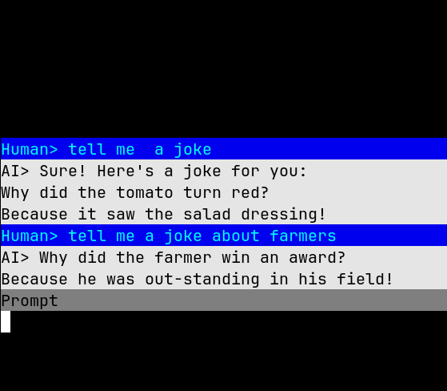

# ai-curses

This is a general wrapper for AI chat services, like OpenAI's chat GPT. In the future this may cover others.



## Installation

Use pyenv, or set a virtual environment up with python 3.11. The best way to make sure you're using the right version of python is to use [pyenv](https://github.com/pyenv/pyenv) to install the right version of python
and then use that binary when making your virtual environment. The example below uses `mkvirtualenv` which comes with [virtualenvwrapper](https://pypi.org/project/virtualenvwrapper/): 

```
mkvirtualenv --python="${HOME}/.pyenv/shims/python3.11" ai-curses
```

Then install poetry, and install the rest of the requirements with:

```
poetry install
```

This runs fine on macOS, but if you run into problems with Linux complaining about curses not being there, that
means you have to install python with certain development libraries (this is the main reason to use pyenv, it makes installing Python versions a lot easier to manage).

The test to make sure curses is installed is starting python3.11's IDE and trying "import curses" If it doesn't come back with an error, that means your system should be good to run this.

```
Python 3.11.2 (main, Mar 26 2023, 21:24:17) [GCC 9.4.0] on linux
Type "help", "copyright", "credits" or "license" for more information.
>>> import curses
>>> 
```

These are the libraries I needed to install on ZorinOS, an Ubuntu-based distro, to get it to work. Consult your distro's documentation for more information on installing these packages.

```
libncurses5 
libncurses5-dev 
libncursesw5 
libbz2-dev 
liblzma-dev 
tk-dev 
libreadline-dev
libsqlite3-dev
```

## Authentication

In order to use this program, you need to have a value set for `CHATGPT_TOKEN` in your environment. It's best to set this in your shell as an environment variable.

```
export CHATGPT_TOKEN="<YOUR-OPENAI-TOKEN>"
```

To get a token, make an account on the openAI platform. Be sure you set a spending limit you are comfortable with, as you will be charged for any usage that your API key is used for:

https://platform.openai.com/account/api-keys

https://platform.openai.com/account/billing/limits


## Running

To run, use `main.py`, that uses the chat API that OpenAI offers. The requests for the `/v1/chat/completions` endpoint make it easier to manage the conversation length and how much content is being pushed in each request.

```
./main.py [OPTIONS]
```

To see help, run:

```
./main.py -h
```

## Running Options

If you have longer prompts and options you want to reuse, the best way to handle that is to write an INI file and load it when running the program (see Sample Config below). 

```
./main.py -c my-prompt.ini
```

You can also use the INI files in conjunction with the `-l` flag, to load a previous session:

```
./main.py -c my-prompt.ini -l "2023-04-01 at 11_36_15_579128_AM.json"
```

## Output to file

One of the options `-o` allows you to output content to a directory (not an exact file name). When you do so, you get two files, a `.md` file and a `.json` file. Example:

```
2023-04-01 at 11_36_15_579128_AM.md
2023-04-01 at 11_36_15_579128_AM.json
```

The markdown format is just for everyday use by humans. The JSON file can be loaded back into the program when running (see Running Options above), so you can continue the conversation you were having, with all the previous history.

At this time, there are no formatting, templating, or naming options for output, but that is something that could be possible in the future.


## Sample Config

The `-c` or `--config` flag points to an INI config file so that you can set options without having large amounts of flags or text in your command.

This is a sample INI file. The `output` option should be a full absolute path to a directory, the actual filename will be generated based on the system time and date.

```
[options]
timeout = 60
super = """
    You are helping me write a story set in a fantasy world. 
    Limit the responses to two to three paragraphs, and include some dialogue when appropriate. 
    The story is set in a world where kings and kingdoms run everything and magic is real,
    controlled by powerful wizards.
    Do not attempt to end the story, each response should lead to a new plotpoint 
    or adventure.
    """
output = /home/user/somedir
```

### Options

- **timeout**: The time, in seconds, the program will wait for a response from the API. Default: 95 seconds
- **super**: The system prompt that is always the first message in the list of messages sent to the API. Use this to set up a more precise use case, that will be an assumption that the AI will use for all your other messages. Default: "You are a helpful assistant."
- **output**: Set a directory on your local system to save the output. Default: Not set, no output file is generated.

## Exiting the program

To exit the program just type `exit` or `quit` into the chat and hit enter. That text will not be processed by the API, it will simply exit the program.

## Meta-commands

Meta-commands are commands that show metainformation about the conversation, and do not interact with the AI api or appear in the markdown or JSON output. To differentiate them from text being sent to the AI, all commands must begin with a `:` (colon) character. This colon will key the program to not send the text to
the AI, or add it to the output files.

```
:help - Show help.
:history - Show current history stats.
:settings - Show the current settings of this session.
:prompt - Show the current system prompt (super command).
:image [PROMPT] - Create an image with a prompt. You must provide a prompt, and there must be an output directory set in the config or with the -o flag.
```

If a command is unknown, the program shows an error message, and you can continue talking with the AI.


## TODO (ideas for improvements)

[ ] Custom colors for output

[ ] Templating system for Markdown output.

[ ] Add system to specify names of files and output options.